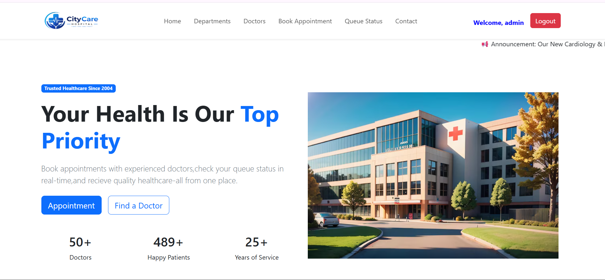
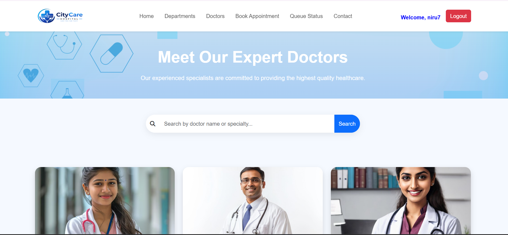
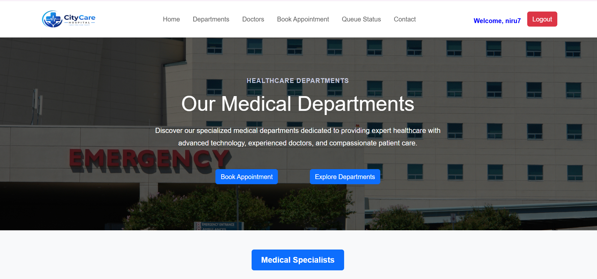
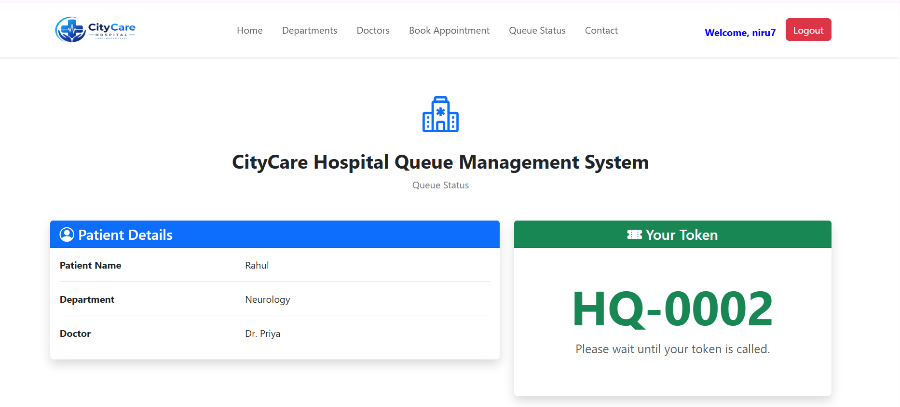
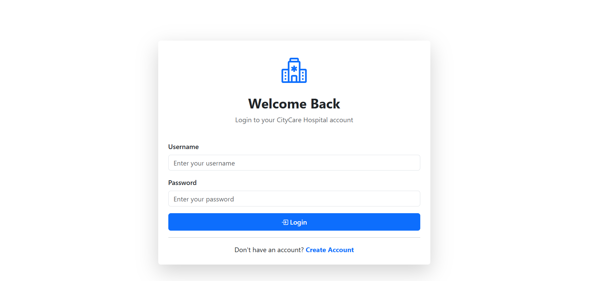
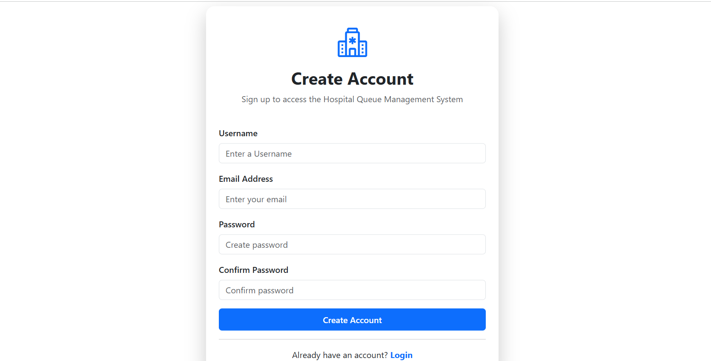

# 🏥 CityCare Hospital Queue Management System

A modern **Hospital Queue Management System** built with **Django**, **Bootstrap 5**, and **JavaScript**. The application allows patients to book appointments, receive queue tokens, and monitor their live queue status through a clean and responsive interface.

---

## 📌 Features

### 👤 User Authentication

* User Registration
* User Login
* User Logout
* Protected Appointment and Queue pages using Django Authentication
* Dynamic Navbar based on login status

### 🏥 Hospital Website

* Responsive Home Page
* About Hospital
* Contact Page
* Emergency Contact Section
* Hospital Services

### 👨‍⚕️ Doctors & Departments

* Browse Hospital Departments
* View Doctors
* Department-wise Doctor Listing
* Doctor Details

### 📅 Appointment Booking

* Book appointments online
* Client-side form validation using JavaScript
* Date and time validation
* Email validation
* Phone number validation
* Age validation
* Department & Doctor selection
* Success/Error feedback

### 🎫 Queue Management

* Automatic Queue Token Generation
* Patient Information Display
* Appointment Details
* Live Queue Status
* People Ahead Calculation
* Estimated Waiting Time
* Queue Status (Waiting / Now Serving / Completed)

### 💾 Local Storage

* Stores appointment details
* Generates unique queue tokens
* Reads appointment information on Queue page

---

# 🛠 Tech Stack

### Frontend

* HTML5
* CSS3
* Bootstrap 5
* JavaScript (ES6)

### Backend

* Django
* Python

### Database

* SQLite3

---

# 📂 Project Structure

```text
hospital/
│
├── accounts/
├── appointments/
├── doctors/
├── queueapp/
├── website/
├── static/
│   ├── css/
│   ├── js/
│   └── images/
├── templates/
├── media/
├── db.sqlite3
├── manage.py
└── README.md
```

---

# 🚀 Installation

### Clone the Repository

```bash
git clone https://github.com/Nirupama-07/Hospital-Queue-Management
```

### Move into the project

```bash
cd HospitalQueue
```

### Create Virtual Environment

```bash
python -m venv venv
```

### Activate Virtual Environment

**Windows**

```bash
venv\Scripts\activate
```

**Mac/Linux**

```bash
source venv/bin/activate
```

### Install Dependencies

```bash
pip install -r requirements.txt
```

### Apply Migrations

```bash
python manage.py migrate
```

### Run the Server

```bash
python manage.py runserver
```

Open your browser and visit:

```
http://127.0.0.1:8000/
```

---

# 📸 Screenshots

Screenshots of the following pages:

* 🏠 Home Page

* 👨‍⚕️ Doctors

* 🏥 Departments

* 📅 Appointment Form

* 🎫 Queue Status

* 🔐 Login

* 📝 Signup


---

# ✨ Future Improvements

* Admin Dashboard
* Email Appointment Confirmation
* SMS Notifications
* QR Code Based Queue Token
* Doctor Dashboard
* Patient Dashboard
* Online Payment Integration
* Real-Time Queue Updates using WebSockets
* Queue Analytics & Reports

---

# 📚 What I Learned

* Django Authentication
* Django Models & Forms
* Template Inheritance
* URL Routing
* Static & Media Files
* JavaScript Form Validation
* Local Storage
* Queue Management Logic
* Bootstrap Responsive Design

---

# 🤝 Contributing

Contributions are welcome!

1. Fork the repository
2. Create your feature branch
3. Commit your changes
4. Push to your branch
5. Open a Pull Request

---

# 📄 License

This project is created for learning and educational purposes.

---

# 👩‍💻 Developer

**Nirupama Majhi**

* GitHub: https://github.com/Nirupama-07

If you found this project helpful, don't forget to ⭐ the repository!
